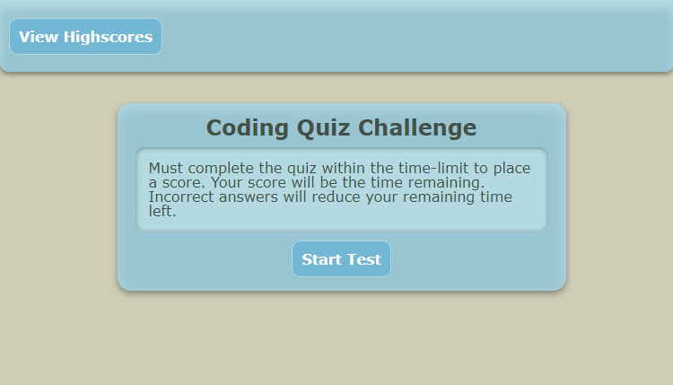
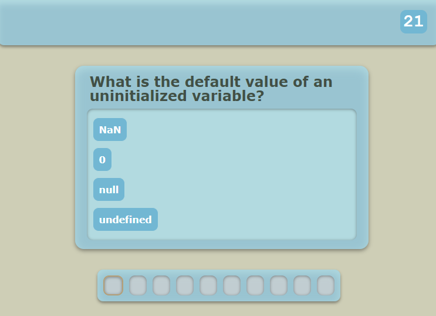

# Code-Quiz

# Description

A timed quiz on basic javascript, with randomization, penalties, local score saving, and progress tracking.

# Screenshots




# Deployed

[https://vicdotexe.github.io/code-quiz/](https://vicdotexe.github.io/code-quiz/)

# Assignment

## *User Story*

```
AS A coding boot camp student
I WANT to take a timed quiz on JavaScript fundamentals that stores high scores
SO THAT I can gauge my progress compared to my peers
```

## *Acceptance Criteria*

```
GIVEN I am taking a code quiz
WHEN I click the start button
THEN a timer starts and I am presented with a question
WHEN I answer a question
THEN I am presented with another question
WHEN I answer a question incorrectly
THEN time is subtracted from the clock
WHEN all questions are answered or the timer reaches 0
THEN the game is over
WHEN the game is over
THEN I can save my initials and my score
```

# License
[MIT Licence](https://github.com/vicdotexe/code-quiz/blob/main/LICENSE)